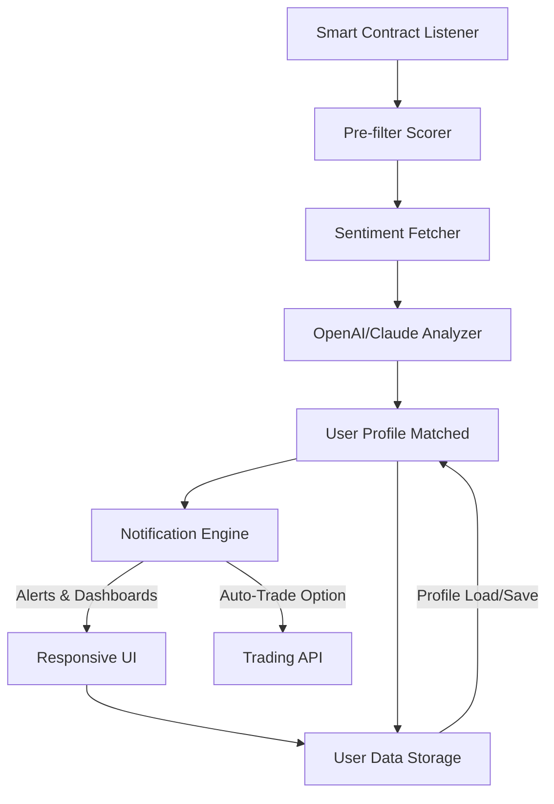

# 🚀 bsc-fourmeme-analyzer-bot: Next-Gen Meme Token Discovery with Advanced Analytics

  

---

**DESCRIPTION:**  
Supercharge your journey in the BSC meme token space with `bsc-fourmeme-analyzer-bot`: an AI-enhanced, analytics-first platform for discovering, evaluating, and tracking new meme token launches. Move beyond bots that just buy — this cutting-edge analyzer uses machine learning, real-time data visualization, multi-language notifications (including emoji-rich alerts!), and sentiment analysis powered by OpenAI and Claude API. Designed for passionate traders and data-driven pioneers, it’s a toolkit for distinguishing memes with real momentum from fleeting hype.

---

## ⭐ Table of Contents  
- 🚦 [Quick Start & Download](#quick-start-download)
- 🌟 [Full Feature List](#full-feature-list)
- 🛠️ [OS Compatibility Matrix](#os-compatibility-matrix)
- 🧬 [How It Works: Project Architecture](#how-it-works-project-architecture)
- 🖼️ [Mermaid Diagram](#mermaid-diagram)
- 🧩 [Example Profile Configuration](#example-profile-configuration)
- 🏁 [Example Console Invocation](#example-console-invocation)
- 💡 [SEO-Driven Highlights](#seo-driven-highlights)
- 🌐 [OpenAI & Claude API Integration](#openai-claude-api-integration)
- 🌏 [Multilingual Support](#multilingual-support)
- 🕰️ [24/7 Support & Responsive UI](#247-support-responsive-ui)
- ⚠️ [Disclaimer](#disclaimer)
- 📜 [License](#license)
- 📥 [Download Again](#download-again)

---

## 🚦 Quick Start & Download

Get the latest innovation in meme token analytics for the Binance Smart Chain.

**Download Now:**  
  

---

## 🌟 Full Feature List

- **AI-powered Scoring Engine:** Uses OpenAI and Claude APIs to estimate a meme token’s potential, factoring in on-chain data, social signals, and historic patterns.
- **Responsive Interactive UI:** Enjoy a fluid, desktop or mobile experience — charts, alerts, and dashboards adapt seamlessly.
- **Multi-Language Alerts:** Get real-time trade signals in English 🌐, Español 🌎, Português 🌍, Mandarin 中文, 🇰🇷 Korean, and more.
- **Smart Trend Notifications:** Emoji-rich notifications let you know when a token is mooning 🚀 or rug-pulling 🏴‍☠️.
- **Deep Sentiment Analysis:** Collects live tweets and Telegram posts, distilled by LLMs for FOMO, FUD, and authenticity readings.
- **Portable Profile System:** Save and load personalized risk settings, favorite tokens, and notification rules.
- **Safe Trading Action Integration:** Not only tracks — handoff to auto-traders and wallets with safeguard confirmation.
- **24/7 Knowledge Center:** Embedded support chatbot, documentation, FAQ, and ticketing powered by OpenAI's GPT.
- **Data-Driven Visualizations:** Candlestick charts, liquidity movements, volume surges, and unique meme token "virality" graphs.

---

## 🛠️ OS Compatibility Matrix

| Platform      | Install Support | UI Native | Notifications | Notes                |
|---------------|:--------------:|:---------:|:-------------:|----------------------|
| 🪟 Windows    | ✔️              | ✔️        | ✔️            | All versions (10+)   |
| 🍏 macOS      | ✔️              | ✔️        | ✔️            | M1/M2 optimized      |
| 🐧 Linux      | ✔️              | ✔️        | ✔️            | Ubuntu, Arch, Debian |
| 📱 Android    | ✖️              | ✔️(web)   | ✔️(push)      | Progressive Web App  |
| 🍏 iOS        | ✖️              | ✔️(web)   | ✔️(push)      | Progressive Web App  |

---

## 🧬 How It Works: Project Architecture

The bot’s neural-core is powered by real-time on-chain event listeners and AI-based feedback loops. Its modular architecture lets you plug in new notification sources, API keys, or trading strategies — shaping its personality to your meme-seeking DNA.

### ⚡ High-Level Event Path:

- Smart Contract Listener → Pre-filter Scorer → Sentiment Fetcher → OpenAI/Claude LLM Analyzer → User Profile Filter → Notification Engine → UI Dashboard/Trade API

---

## 🖼️ Mermaid Diagram

---

## 🧩 Example Profile Configuration

Configure your ideal setup! The system supports loading YAML or JSON config files.

**example_profile.yaml**  
theme: "midnight"
language: "spanish"
token_watcher:
  - "DOGE"
  - "SHIB"
  - "PEPE"
risk_tolerance: "balanced"
notification_channels:
  - "telegram"
  - "push"
llm_settings:
  enable_openai: true
  enable_claude: false
  openai_api_key: "sk-************"
  auto_translate_alerts: true

---

## 🏁 Example Console Invocation

Activate with your own custom settings:

    bsc-fourmeme-analyzer run --config ./example_profile.yaml --mode realtime

---

## 💡 SEO-Driven Highlights

- **Discover new meme tokens on Binance Smart Chain instantly**
- **AI-enhanced analytics for meme trading and trend detection**
- **Sentiment analysis for meme token legitimacy and hype waves**
- **Fully automated, adaptive meme token alerts and dashboards**
- **OpenAI and Claude AI-powered meme asset evaluations**
- **Easy setup—trade smarter in the ever-shifting meme coin ecosystem**

---

## 🌐 OpenAI & Claude API Integration

Harness the latest advances in generative AI:
- **OpenAI API:** Natural-language insight summaries, FOMO/FUD detector, and 24/7 support chat.
- **Claude API:** Cross-check for bot spam, social sentiment polarity, and legitimacy signals.
- Both APIs can be toggled in your configuration—scored outputs blend for best-of-both-worlds classification.

---

## 🌏 Multilingual Support

Dive in regardless of your language preference. Receive alerts and navigate the dashboard natively in several languages. The translation engine is powered both by Google Translate and fine-tuned AI for meme lingo precision.

---

## 🕰️ 24/7 Support & Responsive UI

- **Always-On Support**: Consult the built-in help center, open tickets, or chat with our virtual assistant, powered by OpenAI GPT (2026 model).
- **Responsive UI**: From power-desktops to palm-sized mobile, the interface adapts seamlessly at every breakpoint, ensuring smooth navigation and vibrant real-time interaction even on slow connections.

---

## ⚠️ Disclaimer

This project is for educational, informational, and research use only. Automated analysis and notifications are subject to changing market conditions, smart contract risks, and external data validity — always double-check token legitimacy and never trade funds you cannot afford to lose. No financial advice is provided.

---

## 📜 License

MIT License, © 2026  
[View LICENSE](LICENSE)

---

## 📥 Download Again

  

---